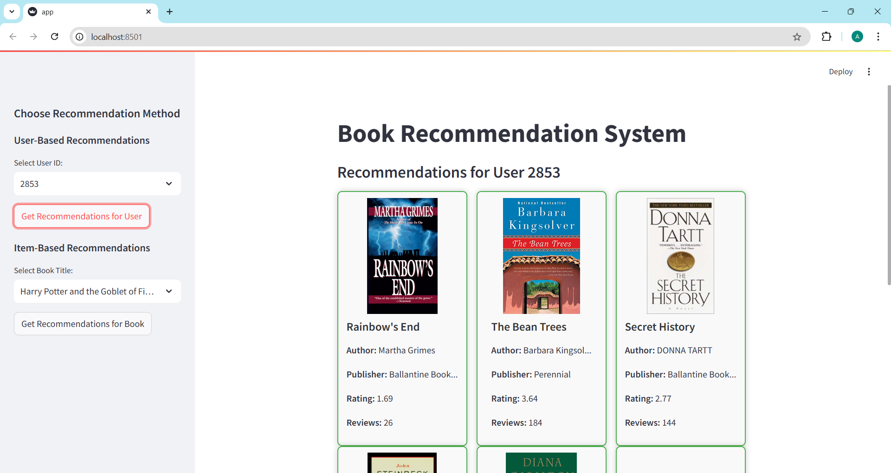
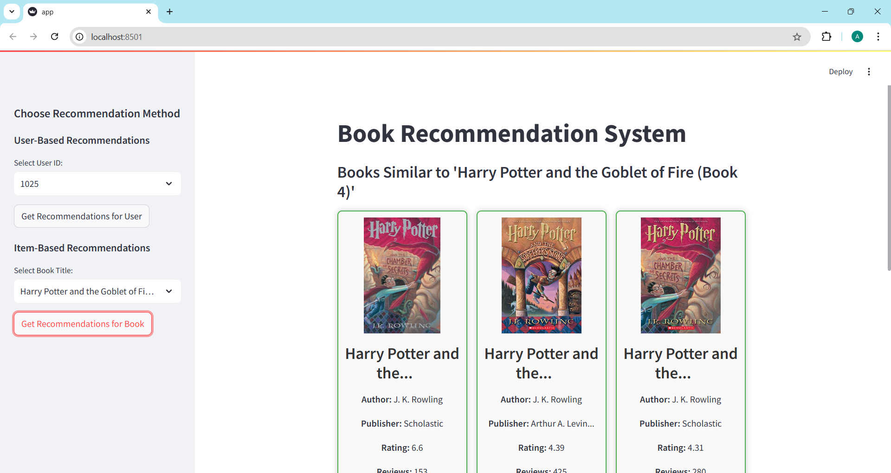

# **Personalized Book Recommender Web App with Collaborative Filtering**  

A **dynamic web-based recommendation system** leveraging **collaborative filtering** to deliver personalized book suggestions.  
Utilizes **user-based** and **item-based similarity models** to analyze user interactions and provide highly relevant book recommendations.


## **Key Features**  
- **Personalized Book Suggestions**: Harnesses **user-user** and **item-item similarity** to recommend books based on individual preferences and reading patterns.
- **Comprehensive Book Metadata**: Displays detailed book information, including title, author, publisher, ratings, and reviews, enhanced with visually engaging cover images.
- **Streamlined User Experience**: Interactive web application built using **Streamlit**, ensuring an intuitive and responsive interface for seamless book discovery.


## **Installation**

Clone the repository:
  ```bash
  git clone https://github.com/AhmedNabil03/book-recommendation-web-app.git
  cd book-recommendation-web-app
  ```

## **Usage**

Launch the Streamlit application:
  ```bash
  streamlit run app.py
  ```

## **Usage Example**

### **User-Based Recommendations**


### **Item-Based Recommendations**



## **Repository Structure**
```bash
├── app.py                     # Streamlit web application code
├── book_recommender.py        # Script for data preparation
├── book_recommender.ipynb     # Jupyter notebook of the script
├── user-based_image.png       # user-based example
├── item-based_image.png       # item-based example
└── README.md            
```
